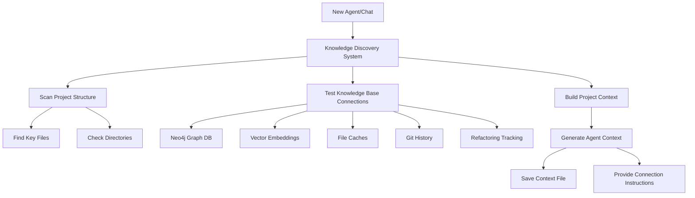

# Agent Knowledge Discovery System

## Overview

The **Agent Knowledge Discovery System** ensures that every new agent or chat session automatically discovers and connects to all available long-term persistent memory systems for this codebase. This eliminates the need for manual setup and ensures consistent access to project knowledge.

## 🎯 Purpose

When a new agent or chat session is created, it needs to:
1. **Discover** what knowledge bases are available
2. **Connect** to persistent memory systems (Neo4j, file caches, git history)
3. **Load** project context and recent developments
4. **Access** CLI tools and integration points
5. **Understand** the current project state and capabilities

## 🏗️ System Architecture



## 🚀 Quick Start for New Agents

### Automatic Initialization

```python
# Add this to the start of any new agent or chat session
from src.ignition.code_intelligence.knowledge_discovery import initialize_agent_knowledge

# This will automatically discover and connect to all available knowledge bases
context = initialize_agent_knowledge()

print(f"✅ Connected to {len(context['knowledge_base_status'])} knowledge bases")
print(f"🎯 Project: {context['project_context']['project_name']}")
print(f"📊 Current Phase: {context['project_context']['current_phase']}")
```

### Manual Discovery

```python
from src.ignition.code_intelligence.knowledge_discovery import KnowledgeDiscoverySystem
from pathlib import Path

# Create discovery system
discovery = KnowledgeDiscoverySystem(Path.cwd())

# Get complete initialization info
init_info = discovery.get_agent_initialization_info()

# Save context for future use
context_file = discovery.save_agent_context()
```

## 📊 Available Knowledge Bases

The system automatically discovers and connects to:

### 1. **Neo4j Graph Database**
- **Type:** `neo4j`
- **Purpose:** Code structure analysis, dependency tracking, refactoring history
- **Connection:** Automatic via environment variables
- **Capabilities:**
  - Code structure analysis
  - Dependency tracking
  - Refactoring history
  - File evolution tracking
  - Complex queries and analytics

### 2. **Vector Embeddings Cache**
- **Type:** `vector_db`
- **Purpose:** Semantic code search and similarity analysis
- **Location:** `.vector_cache/` directory
- **Capabilities:**
  - Semantic code search
  - Similar code detection
  - Context-aware analysis
  - Code similarity metrics

### 3. **Code Analysis Cache**
- **Type:** `file_cache`
- **Purpose:** Cached analysis results for fast re-analysis
- **Location:** `.analysis_cache/` directory
- **Capabilities:**
  - Fast re-analysis
  - Historical comparisons

### 4. **Git History Integration**
- **Type:** `git_history`
- **Purpose:** File evolution and branch analysis
- **Connection:** Automatic via `.git/` directory
- **Capabilities:**
  - File evolution tracking
  - Author analysis
  - Change frequency analysis
  - Branch comparison
  - Merge conflict prediction

### 5. **Refactoring Tracking System**
- **Type:** `refactoring_tracking`
- **Purpose:** Document and track refactoring operations
- **Location:** `.refactoring_tracking/` directory
- **Capabilities:**
  - Operation tracking
  - Architecture diagrams
  - Impact reports
  - TODO management
  - Statistics dashboard

## 🔧 Connection Instructions

### Neo4j Graph Database
```python
from ignition.code_intelligence.manager import CodeIntelligenceManager

manager = CodeIntelligenceManager()
if manager.client.is_connected():
    # Access graph database
    result = manager.client.execute_query("MATCH (n) RETURN count(n)")
    print(f"Connected to Neo4j with {result} nodes")
```

### Git Integration
```python
from ignition.code_intelligence.git_integration import GitIntegration
from pathlib import Path

git_integration = GitIntegration(Path.cwd())
evolution = git_integration.track_file_evolution("path/to/file.py")
```

### Refactoring Tracking
```python
from ignition.code_intelligence.refactoring_tracker import RefactoringTracker
from pathlib import Path

tracker = RefactoringTracker(Path.cwd())
stats = tracker.get_refactoring_statistics()
```

## 📋 Project Context Information

The system provides comprehensive project context including:

### Current Project State
- **Project Name:** IGN Scripts - Code Intelligence System
- **Current Phase:** 8.1 (Completed)
- **Completed Phases:** 1.0 through 8.1

### Key Capabilities
- Automated Code Refactoring
- Large File Detection & Analysis
- Code Splitting with AST Analysis
- Git Integration & Evolution Tracking
- Architecture Diagram Generation
- Neo4j Graph Database Integration
- Comprehensive CLI Interface
- Refactoring Impact Analysis

### Available CLI Commands
```bash
# Core refactoring commands
refactor detect                 # Scan for oversized files
refactor analyze               # Detailed file analysis
refactor split                 # Split individual files
refactor batch-split           # Process multiple files
refactor workflow              # Execute comprehensive workflows
refactor rollback              # Restore previous state

# Advanced tracking commands
refactor track-evolution       # Monitor file evolution
refactor analyze-branch        # Compare branches
refactor tracking-report       # Generate impact reports
refactor generate-diagram      # Create architecture diagrams
refactor complexity-trends     # Show complexity trends
refactor statistics           # Display comprehensive statistics
```

### Recent Developments
- **Phase 8.1 Completion** (January 2025) - Completed Code Intelligence System
- **Git Integration Added** - File evolution tracking and branch analysis
- **Documentation System** - Architecture diagrams and TODO generation

## 🔍 Environment Setup

### Required Environment Variables
```bash
# Neo4j Database Connection
NEO4J_URI=bolt://localhost:7687
NEO4J_USER=neo4j
NEO4J_PASSWORD=your_password

# Optional enhancements
OPENAI_API_KEY=your_openai_key      # For AI-powered analysis
GITHUB_TOKEN=your_github_token      # For enhanced git integration
```

### Key Files to Read
1. `docs/roadmap.md` - Current project status and roadmap
2. `docs/PHASE_8_1_COMPLETION_SUMMARY.md` - Latest achievements
3. `src/ignition/code_intelligence/` - Core intelligence modules
4. `.env.sample` - Environment variable examples

## 💾 Context Persistence

### Automatic Context Saving
The system automatically saves agent context to `.agent_context.json`:

```json
{
  "project_context": {
    "project_name": "IGN Scripts - Code Intelligence System",
    "current_phase": "8.1 (Completed)",
    "key_capabilities": [...],
    "cli_commands": [...]
  },
  "knowledge_base_status": [...],
  "connection_instructions": {...},
  "quick_start_guide": "...",
  "available_tools": [...]
}
```

### Loading Existing Context
```python
from src.ignition.code_intelligence.knowledge_discovery import KnowledgeDiscoverySystem

# Load existing context
context = KnowledgeDiscoverySystem.load_agent_context()

# Or specify custom location
context = KnowledgeDiscoverySystem.load_agent_context(Path("custom_context.json"))
```

## 🎯 Integration with New Agents

### For AI Assistants/Agents
Add this initialization code at the start of any new session:

```python
# Initialize knowledge discovery
from src.ignition.code_intelligence.knowledge_discovery import initialize_agent_knowledge

try:
    context = initialize_agent_knowledge()

    # Now you have access to:
    # - context['project_context'] - Full project information
    # - context['knowledge_base_status'] - Available databases
    # - context['connection_instructions'] - How to connect
    # - context['available_tools'] - Tools and their usage

    print("🎉 Agent successfully connected to project knowledge bases!")

except Exception as e:
    print(f"⚠️ Knowledge discovery failed: {e}")
    print("Continuing with limited context...")
```

### For Chat Systems
Include this in your system prompt or initialization:

```
SYSTEM CONTEXT: This is the IGN Scripts project with a comprehensive Code Intelligence System.
Phase 8.1 has been completed, providing automated refactoring capabilities.

Available knowledge bases have been discovered and connected:
- Neo4j Graph Database for code structure analysis
- Git History Integration for evolution tracking
- Refactoring Tracking System for operation documentation
- Vector Embeddings for semantic code search

Key capabilities include automated refactoring, large file detection, git integration,
architecture diagram generation, and comprehensive impact analysis.

Use the CLI commands starting with 'refactor' to access system functionality.
```

## 🔄 Automatic Updates

The knowledge discovery system automatically:
- **Refreshes** knowledge base connections on each initialization
- **Updates** project context with latest developments
- **Saves** updated context for future sessions
- **Validates** connection status for all knowledge bases

## 🛠️ Troubleshooting

### Common Issues

**Neo4j Connection Failed**
```bash
# Check environment variables
echo $NEO4J_URI $NEO4J_USER $NEO4J_PASSWORD

# Test connection manually
python -c "from neo4j import GraphDatabase; print('Neo4j driver available')"
```

**Git Integration Error**
```bash
# Ensure you're in a git repository
git status

# Check git command availability
which git
```

**Missing Knowledge Bases**
```python
# Run discovery to see what's available
from src.ignition.code_intelligence.knowledge_discovery import KnowledgeDiscoverySystem

discovery = KnowledgeDiscoverySystem()
for kb in discovery.knowledge_bases:
    print(f"{kb.name}: {kb.status} - {kb.description}")
```

## 📈 Benefits

### For New Agents
- **Instant Context** - Immediate access to project knowledge
- **Automatic Discovery** - No manual configuration required
- **Consistent Experience** - Same knowledge base access across sessions
- **Up-to-date Information** - Always current project state

### For Development Team
- **Reduced Onboarding** - New team members get instant context
- **Knowledge Preservation** - Project knowledge is automatically accessible
- **Consistent Documentation** - Standardized project information
- **Improved Productivity** - Less time spent explaining project context

---

## 🚀 Getting Started

To use this system with a new agent or chat session:

1. **Import the system:**
   ```python
   from src.ignition.code_intelligence.knowledge_discovery import initialize_agent_knowledge
   ```

2. **Initialize knowledge:**
   ```python
   context = initialize_agent_knowledge()
   ```

3. **Access project information:**
   ```python
   print(f"Project: {context['project_context']['project_name']}")
   print(f"Phase: {context['project_context']['current_phase']}")
   print(f"Available tools: {len(context['available_tools'])}")
   ```

4. **Connect to knowledge bases:**
   ```python
   # Follow connection instructions in context['connection_instructions']
   ```

The system will handle the rest automatically! 🎉
