# Phase 9.5: AI Assistant Module - Strategic Implementation Plan

**Status**: 🚧 **PLANNING** - January 28, 2025  
**Phase**: 9.5 - AI Assistant Module  
**Timeline**: 6 weeks (Weeks 9-14)  
**Version**: 0.3.0  

## Executive Summary

Phase 9.5 will transform our existing AI capabilities into a comprehensive, context-aware assistant integrated directly into the Ignition Module framework. Building on our strong foundation of 10,389+ Neo4j nodes, 384D vector embeddings, and complete module infrastructure, we'll create an intelligent assistant that understands projects, learns from usage patterns, and provides adaptive guidance.

## Strategic Architecture

### **Foundation Analysis**

**✅ Current Strengths:**
- **Complete Module Framework** - AbstractIgnitionModule with lifecycle management
- **Rich AI Infrastructure** - 4 existing AI commands with Neo4j integration
- **Code Intelligence System** - Pattern analysis and recommendation engine
- **Data Integration Module** - 38+ sources with industrial metadata framework
- **Script Generation Module** - Dynamic templates with AI-powered recommendations

**🎯 Strategic Objectives:**
- **Native Integration** - Full Ignition module with Gateway/Designer/Client hooks
- **Context Awareness** - Project-specific intelligence and memory
- **Adaptive Learning** - Continuous improvement from usage patterns
- **Multi-Interface Access** - CLI, Designer panels, and API endpoints

### **Technical Architecture Decision: Hybrid Progressive Approach**

```mermaid
graph TB
    A["AIAssistantModule<br/>🤖 Core Intelligence"] --> B["Local Models<br/>🔒 Ollama/llama.cpp"]
    A --> C["Cloud Models<br/>🚀 Anthropic/OpenAI"]
    A --> D["Knowledge Systems<br/>📚 Neo4j + Vectors"]
    
    B --> E["Fast Inference<br/>⚡ 3B Parameter"]
    C --> F["Complex Reasoning<br/>🧠 Sonnet/GPT-4"]
    D --> G["Project Context<br/>📋 Current State"]
    D --> H["Pattern Library<br/>🔍 10k+ Nodes"]
    
    A --> I["Interface Layer"]
    I --> J["CLI Commands<br/>💻 Developer Tools"]
    I --> K["Designer Panels<br/>🎨 Visual Interface"]
    I --> L["Gateway Service<br/>⚙️ Background Processing"]
    
    style A fill:#e1f5fe
    style B fill:#e8f5e8
    style C fill:#fff3e0
    style D fill:#f3e5f5
```



## Implementation Phases

### **Phase 9.5A: Enhanced CLI AI Assistant** (Weeks 1-2)

#### **Objective**: Transform existing AI commands into comprehensive assistant

**Key Deliverables:**
1. **Enhanced AI Command Group** (`src/ignition/modules/cli/ai_assistant_commands.py`)
   - Extend existing 4 commands with conversation context
   - Add project analysis and recommendation capabilities
   - Implement memory persistence across sessions

2. **Conversation Management System**
   - Session-based context retention
   - Multi-turn conversation support
   - Project-specific memory and preferences

3. **Integration with Module Framework**
   - Leverage AbstractIgnitionModule for project analysis
   - Access to configuration and lifecycle management
   - Integration with existing data integration and script generation modules

**Technical Specifications:**
```python
# Enhanced AI Assistant CLI Structure
@click.group(name="ai")
def ai_assistant_group():
    """AI Assistant commands for intelligent development support."""
    pass

@ai_assistant_group.command("chat")
@click.option("--context", help="Project context path")
@click.option("--memory", is_flag=True, help="Enable conversation memory")
def chat_command(context: str, memory: bool):
    """Interactive AI chat with project awareness."""
    pass

@ai_assistant_group.command("analyze")
@click.argument("target", type=click.Path(exists=True))
@click.option("--depth", type=click.Choice(["quick", "detailed", "comprehensive"]))
def analyze_command(target: str, depth: str):
    """Comprehensive project or file analysis."""
    pass

@ai_assistant_group.command("recommend")
@click.option("--task", help="Current development task")
@click.option("--context", help="Project context")
def recommend_command(task: str, context: str):
    """Get AI recommendations for development tasks."""
    pass
```

### **Phase 9.5B: Module Integration Foundation** (Weeks 3-4)

#### **Objective**: Create native Ignition module with full framework integration

**Key Deliverables:**
1. **AIAssistantModule Implementation** (`src/ignition/modules/ai_assistant/`)
   - Complete AbstractIgnitionModule implementation
   - Gateway, Designer, and Client hook support
   - Configuration management and persistence

2. **Designer Panel Integration Framework**
   - Panel component for in-Designer AI assistance
   - Context-aware help and suggestions
   - Real-time code analysis and recommendations

3. **Gateway Service Implementation**
   - Background processing for complex analysis
   - Project monitoring and health assessment
   - Automated recommendation generation

**Module Structure:**
```python
class AIAssistantModule(AbstractIgnitionModule):
    """AI Assistant Module for intelligent Ignition development support."""
    
    def __init__(self, context: ModuleContext):
        metadata = ModuleMetadata(
            name="AI Assistant Module",
            id="ai-assistant",
            version="1.0.0",
            description="Intelligent AI assistant for Ignition development",
            vendor="IGN Scripts",
            scopes=[ModuleScope.GATEWAY, ModuleScope.DESIGNER, ModuleScope.CLIENT],
            min_ignition_version="8.1.0",
        )
        super().__init__(metadata, context)
        
        # AI Components
        self.local_model = None
        self.cloud_model = None
        self.knowledge_graph = None
        self.conversation_manager = None
        self.project_analyzer = None
```

### **Phase 9.5C: Learning and Adaptation System** (Weeks 5-6)

#### **Objective**: Implement adaptive learning and personalized assistance

**Key Deliverables:**
1. **Project Learning System**
   - Project-specific pattern recognition
   - Usage history and preference learning
   - Contextual recommendation improvement

2. **Adaptive Intelligence Engine**
   - Personalized assistance based on developer behavior
   - Team collaboration and knowledge sharing
   - Continuous improvement feedback loops

3. **Advanced Analysis Capabilities**
   - Comprehensive project health assessment
   - Dependency analysis and visualization
   - Performance optimization suggestions
   - Security audit and compliance checking

## Technical Implementation Details

### **Model Integration Strategy**

**Local Models (Primary):**
- **Ollama Integration**: llama3.2:3b for fast, private inference
- **Use Cases**: Code completion, basic analysis, quick questions
- **Benefits**: Privacy, speed, no internet dependency

**Cloud Models (Fallback):**
- **Anthropic Claude**: Complex reasoning and analysis
- **Use Cases**: Comprehensive project analysis, advanced troubleshooting
- **Benefits**: Superior capability for complex tasks

**Knowledge Systems:**
- **Neo4j Graph**: 10,389+ nodes for code intelligence
- **Vector Embeddings**: 384D semantic search
- **Project Context**: Live project state and configuration

### **Integration Points**

**Existing Module Integration:**
```python
class AIAssistantModule:
    def initialize_module(self) -> bool:
        # Integrate with existing modules
        self.data_integration = self._get_module("data-integration")
        self.script_generation = self._get_module("script-generation")
        
        # Initialize AI components
        self.local_model = OllamaClient("llama3.2:3b")
        self.knowledge_graph = Neo4jClient()
        self.project_analyzer = ProjectAnalyzer(
            data_integration=self.data_integration,
            script_generation=self.script_generation,
            knowledge_graph=self.knowledge_graph
        )
        
        return True
```

**CLI Enhancement:**
```python
# Enhanced CLI with module integration
@ai_assistant_group.command("project-health")
@click.option("--path", default=".", help="Project path to analyze")
def project_health(path: str):
    """Comprehensive project health assessment."""
    try:
        # Use AI Assistant Module for analysis
        module = get_ai_assistant_module()
        health_report = module.analyze_project_health(path)
        
        # Display rich report
        console.print(create_health_report_panel(health_report))
        
    except Exception as e:
        console.print(f"❌ Analysis failed: {e}")
```

## Success Metrics and Validation

### **Technical Metrics**
- **Response Time**: < 2 seconds for local model queries
- **Accuracy**: > 85% for code suggestions and recommendations
- **Integration**: 100% compatibility with existing module framework
- **Memory Usage**: < 4GB for local model deployment

### **User Experience Metrics**
- **Adoption Rate**: > 70% of CLI users engaging with AI commands
- **Satisfaction**: > 4.0/5.0 user satisfaction rating
- **Productivity**: Measurable improvement in development workflow efficiency

### **System Integration Metrics**
- **Module Health**: 100% successful module lifecycle operations
- **Compatibility**: Support for Ignition 8.1+ across all scopes
- **Performance**: No impact on Gateway/Designer performance

## Risk Assessment and Mitigation

### **Technical Risks**
1. **Model Performance**: Local models may have limited capability
   - **Mitigation**: Hybrid approach with cloud fallback
   
2. **Integration Complexity**: Module framework integration challenges
   - **Mitigation**: Leverage existing proven module patterns
   
3. **Memory/Performance**: AI models consuming too many resources
   - **Mitigation**: Quantized models and lazy loading

### **Strategic Risks**
1. **User Adoption**: Developers may not adopt AI assistance
   - **Mitigation**: Gradual introduction, clear value demonstration
   
2. **Accuracy Concerns**: AI providing incorrect suggestions
   - **Mitigation**: Confidence scoring, human validation prompts

## Long-term Vision and Evolution

### **Phase 9.5 → Phase 11 Pathway**
This phase establishes the foundation for the ultimate **Process SME Agent** (Phase 11):

**Phase 9.5 Achievements:**
- Native module integration framework
- Conversation and memory management
- Project-aware intelligence

**Phase 11 Evolution:**
- 8B parameter LLM fine-tuning
- Comprehensive Ignition expertise
- Autonomous development capabilities

### **Continuous Improvement**
- **Knowledge Graph Expansion**: Automatic learning from new projects
- **Model Fine-tuning**: Project-specific model adaptation
- **Community Learning**: Shared knowledge and best practices

## Conclusion

Phase 9.5 represents a critical milestone in our AI journey, transforming existing capabilities into a comprehensive, integrated assistant. By building on our strong foundation and following the hybrid progressive approach, we'll create a system that provides immediate value while establishing the architecture for future advanced capabilities.

The strategic focus on module integration ensures that our AI assistant becomes a native part of the Ignition development experience, setting the stage for the advanced SME agent capabilities planned for Phase 11.

---

**Next Steps:**
1. **Architecture Review**: Validate technical approach with stakeholders
2. **Implementation Planning**: Detailed task breakdown and timeline
3. **Resource Allocation**: Determine development team and infrastructure needs
4. **Risk Mitigation**: Implement contingency plans for identified risks 