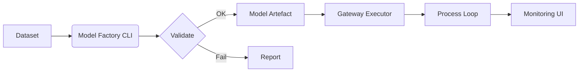

# IGN Helper Module — Detailed Build‑out Framework
*(generated 2025-06-18)*

## 1. Vision & Goals
The Helper Module extends **Ignition 8.1+** with advanced capabilities:

| Pillar | Goal |
|--------|------|
| **Jython Gen** | Auto‑generate robust Jython scripts for Gateway, Tag Change, Vision, Perspective contexts. |
| **AI SME Chat** | 8‑B parameter LLM chatbot, fine‑tuned with Neo4j + vector embeddings, answers Ignition dev questions & writes code. |
| **Mod‑Assist** | Gradle SDK scaffolder, code‑intel for Java/Kotlin, VS Code extension. |
| **GitFlow** | Git‑based project diff/export/import + CI deployment pipelines. |
| **Data Hub** | Secure connectors (JDBC, OPC, Historians), dataset studio, Parquet/CSV export. |
| **Loop IQ** | AI‑supervised loop & variable analytics, KPI scoring, anomaly alerts. |
| **MPC Ops** | MPC model factory (do‑mpc), gateway executor, monitoring UI. |
| **DockOps** | One‑command dev stack, prod Helm chart, automatic side‑car containers. |
| **HMI Plus** | High‑density plots, alarm overview, AI‑powered wizards. |

---

## 2. Reference Architecture
```
├── Ignition Gateway (helper-module.modl)
│   ├─ Jython 2.7 scripts
│   ├─ Java helper classes  (thread pools, HTTP client, MPC bridge)
│   └─ Perspective/HMI Plus views
│
├── AI‑SME Service  (FastAPI, 8‑B LLM, Qdrant, Neo4j)
│
├── MPC Optimiser    (PyTorch + do‑mpc, gRPC)
│
└── Data Hub Stack   (Supabase/PostgreSQL, Influx/Timescale, OPC UA proxy)
```

All containers run on the same **intranet subnet**; communication via mTLS.

---

## 3. Delivery Tracks & Milestones
### 3.1 Foundations (Track A)
| Sprint | Deliverable | Success Gate |
|--------|-------------|--------------|
| A0 | Repo hygiene, ADR template, CI skeleton | Ruff, Mypy, pre‑commit, GitHub Actions |
| A1 | Headless Gateway test harness | Docker image + minimal license |
| A2 | Performance budget gate | `pytest‑benchmark`, p95 tag script < 5 ms |

### 3.2 Script Generation & GitFlow (Track B)
1. **Template Engine:** Jinja2 + 40 templates, error‑handling wrappers.
2. **Git Workflows:** `ign export project --git`, 3‑way merge import, PR CI.
3. **Streamlit UI parity:** generator features reachable by non‑CLI users.

### 3.3 AI SME Chat (Track C)
1. Neo4j schema + Qdrant vector DB.
2. LoRA fine‑tune 8‑B model; quantize for on‑prem inference.
3. FastAPI `/chat` endpoint + Perspective panel.

### 3.4 Data Hub & Loop IQ (Track D)
* Secure connectors (Vault).
* Dataset curation wizard (profiling, quality score).
* Loop KPI engine (variance, CO oscillation) and ML model training.

### 3.5 MPC Ops (Track E)
* `ign mpc init`, YAML config, model artefact.
* Java executor + safe PID fallback.
* Monitoring UI with constraint alerts.

### 3.6 Advanced (Track F)
* Gradle SDK scaffolder, VS Code ext.
* HMI Plus widgets.
* Helm chart + one‑command dev stack.

---

## 4. Development Workflow
1. **Clone & start dev stack**
   ```bash
   git clone <repo>
   make dev-up       # Gateway + side-cars
   ```
2. **Generate script**
   ```bash
   ign gen script --type gateway-startup --name InitNeo4j
   ```
3. **Chat with AI SME** in Perspective panel.
4. **Commit** using Conventional Commits; CI matrix runs.
5. **Deplåoy** via `ign deploy package --env staging`.
å
---

## 5. Performance & Security Practices
* Pre‑compile hot helpers into `.class` files.
* Java `ExecutorService` exposed to Jython (`system.helper.submit`).
* Nightly HNSW autotune (ef, m).
* Trivy image scan; cosign sign *.modl*.
* Prometheus exporters for all side‑cars; Loki log routing.

---

## 6. CI/CD Pipeline
| Stage | Job | Key Steps |
|-------|-----|-----------|
| **Lint/Test** | Py 3.11/3.12 + Jython | Ruff, pytest, coverage |
| **Gateway API** | Ignition 8.1.LTS & 8.1.latest headless | Load module, run E2E |
| **Build** | Docker buildx | Push images w/ tags |
| **Perf Bench** | pytest‑benchmark | Fail if p95 regresses > 10 % |
| **Security** | Trivy + SBOM | Block on critical CVEs |
| **Release** | cosign sign, GH Release | Upload *.modl*, Docker images |

---

## 7. Dataset & ML Life‑cycle
1. Connect sources → preview schema.
2. Curation wizard: profiling, null‑fill, anomaly tag.
3. Export Parquet + manifest to `/datasets`.
4. ML pipeline: time‑series split, model train, metrics.
5. Register artefact in Supabase registry.

---

## 8. MPC Workflow


---

## 9. User‑Facing Enhancements
* **AI SME Wizard**: generates Vision/Perspective scripts on prompt.
* **HMI Plus**: alarm dashboard, live KPI plots, AI annotations.
* **Energy KPI Pack**: steam, NG, electricity vs throughput.

---

## 10. Extensibility & Future Ideas
* Edge Connector Kit (Rust) for non‑OPC PLCs.
* Time‑Shift Simulation Gateway for offline testing.
* Auto‑doc sync & type‑stub nightly publishing.

---

*End of Framework*
